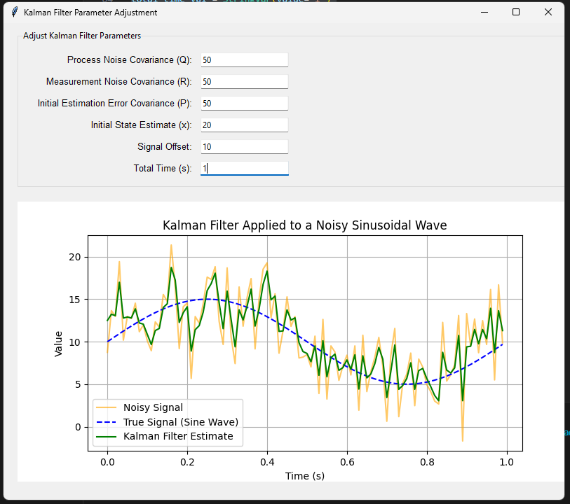
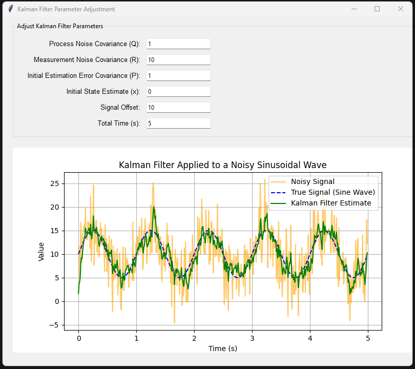
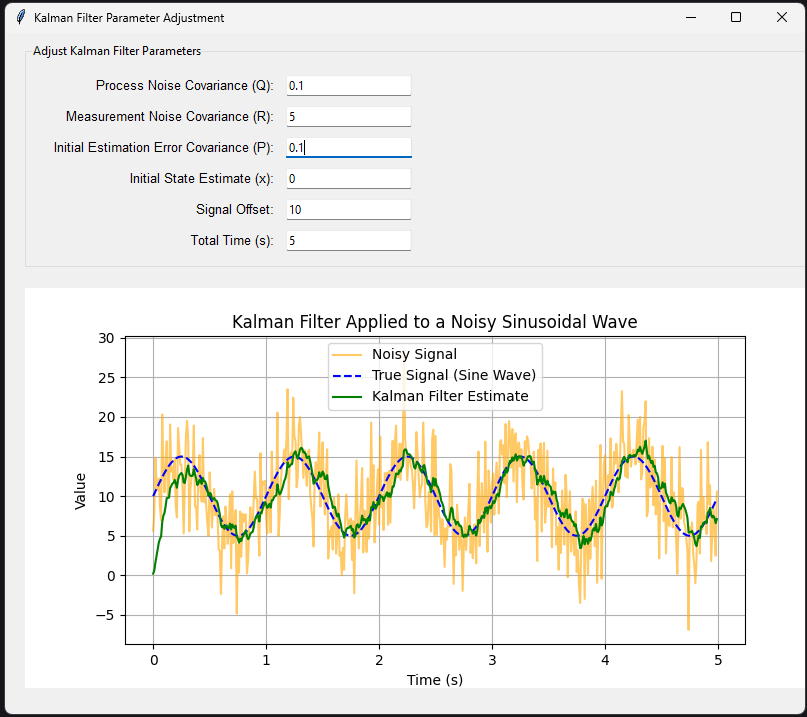

# lab_7
# Дослідження фільтра Калмана

Приклад 1: Найгірша фільтрація
Q: 100, R: 1, P: 100, x: 50, Offset: 0, Total Time: 0.2
Велике значення Q означає, що фільтр очікує високий рівень шуму в процесі, що змушує його часто коригувати передбачення. Низьке R змушує фільтр надмірно довіряти шумним вимірюванням. Велике початкове значення P та початкова оцінка x, яка сильно відрізняється від істинного стану, спричиняють великі початкові помилки. Короткий час симуляції не дозволяє фільтру адаптуватися.

Приклад 2: Погана фільтрація
Q: 50, R: 50, P: 50, x: 20, Offset: 10, Total Time: 1
Значення Q та P все ще досить високі, що спричиняє великі коливання передбачення та корекції. Помірне значення R означає, що фільтр не надто довіряє вимірюванням, тому оцінка нестабільна. З часом фільтр намагається покращити результат, але йому важко налаштуватися.

Приклад 3: Середня фільтрація
Q: 10, R: 10, P: 10, x: 10, Offset: 10, Total Time: 2
Значення Q, R, і P знижені до помірних рівнів, що дозволяє фільтру працювати стабільніше. Початкове значення x та offset відповідають реальному сигналу, а час симуляції достатній для спостереження за роботою фільтра. Результат фільтрації прийнятний, але фільтр все ще може трохи відставати від істинного сигналу.

Приклад 4: Добра фільтрація
Q: 1, R: 10, P: 1, x: 0, Offset: 10, Total Time: 5
Низьке значення Q зменшує коливання фільтра. R і P також добре налаштовані для стабільної роботи. Початкове значення x та offset відповідають початковим параметрам сигналу, а тривале моделювання дозволяє фільтру повністю адаптуватися до реального сигналу. Фільтр ефективно усуває шум і слідкує за сигналом з високою точністю.

Приклад 5: Найкраща фільтрація
Q: 0.1, R: 5, P: 0.1, x: 0, Offset: 10, Total Time: 5
Дуже низькі значення Q і P дозволяють фільтру відслідковувати сигнал з мінімальними коливаннями, а знижене R дає змогу досить добре довіряти вимірюванням. Початковий стан і зсув ідеально відповідають параметрам сигналу, а час симуляції дозволяє спостерігати стабільну і точну фільтрацію з мінімальним впливом шуму. Це найкраще налаштування для точного відстеження сигналу.

