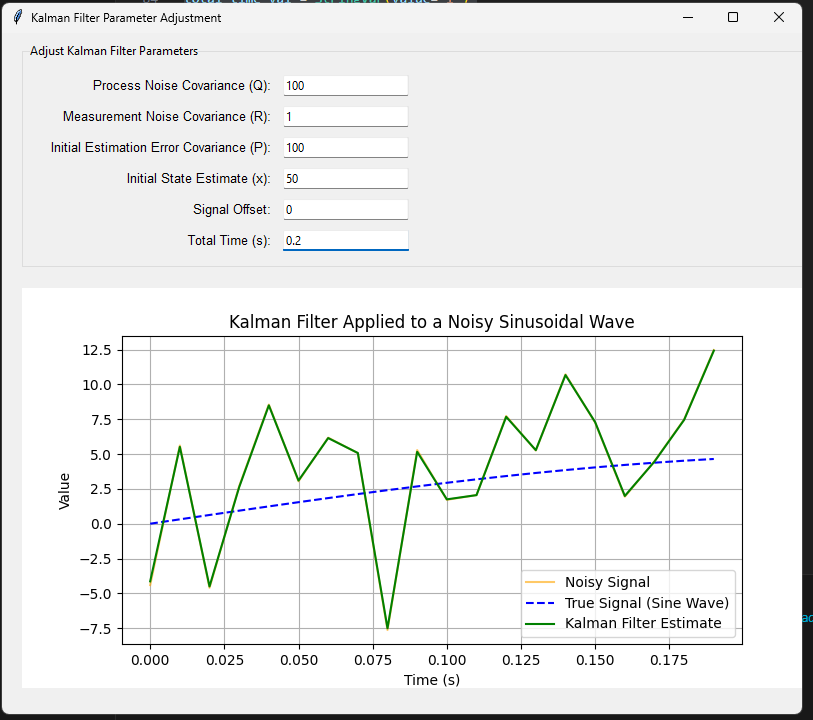
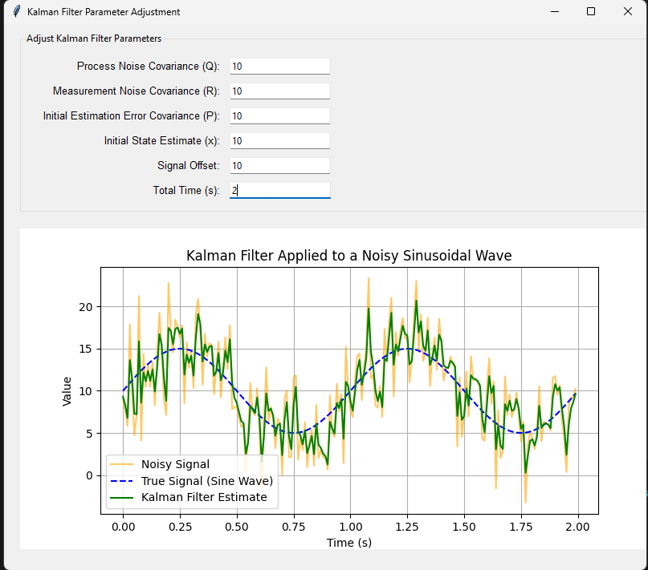

# lab_7
#Дослідження фільтра Калмана

Приклад 1: Найгірша фільтрація
Q: 100, R: 1, P: 100, x: 50, Offset: 0, Total Time: 0.2
Великий Q і занижений R змушують фільтр занадто сильно реагувати на шум. Короткий час не дає фільтру адаптуватися.

Приклад 2: Погана фільтрація
Q: 50, R: 50, P: 50, x: 20, Offset: 10, Total Time: 1
Помірні Q, R і P покращують фільтрацію, але фільтр все ще нестабільний і повільно адаптується.

Приклад 3: Середня фільтрація
Q: 10, R: 10, P: 10, x: 10, Offset: 10, Total Time: 2
Знижені Q, R, і P стабілізують роботу фільтра, який тепер краще слідує сигналу.

Приклад 4: Добра фільтрація
Q: 1, R: 10, P: 1, x: 0, Offset: 10, Total Time: 5
Низькі Q і P зменшують коливання, а тривалий час симуляції дозволяє фільтру адаптуватися до сигналу.

Приклад 5: Найкраща фільтрація
Q: 0.1, R: 5, P: 0.1, x: 0, Offset: 10, Total Time: 5
Дуже низькі Q, R, і P забезпечують стабільне відстеження сигналу з мінімальним шумом.

